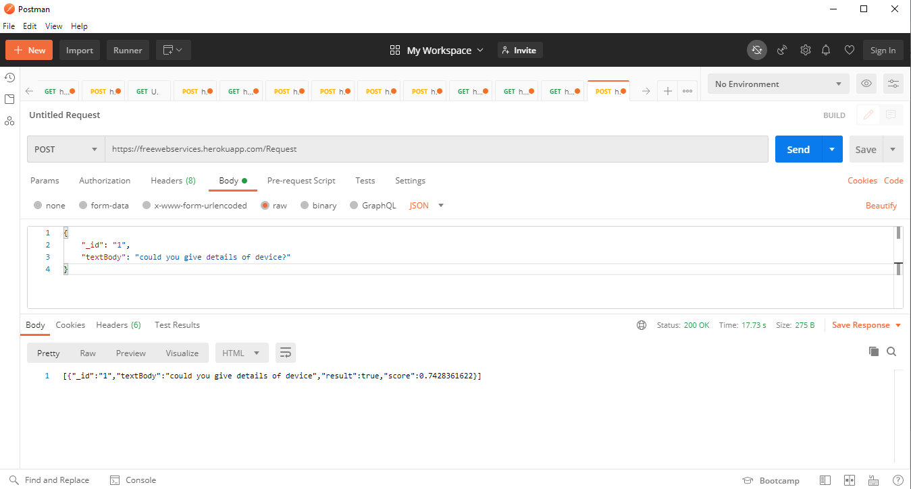

            
            .  .     .               .   .                                   .
            |\ |     |               |   |                                   |             o  ,- o
            | \| ,-: |-  . . ;-. ,-: |   | ,-: ;-. ,-: . . ,-: ,-: ,-.   ,-. | ,-: ,-. ,-. .  |  . ,-. ;-.
            |  | | | |   | | |   | | |   | | | | | | | | | | | | | |-'   |   | | | `-. `-. |  |- | |-' |
            '  ' `-` `-' `-` '   `-` '   ' `-` ' ' `-| `-` `-` `-| `-'   `-' ' `-` `-' `-' '  |  ' `-' '
                                                   `-'         `-'                           -'
# Introduction
This package is to classify the sentenses into two categories.



# API example
```python
import requests
import json
url = 'https://freewebservises.herokuapp.com/Request'
headers = {'content-type': 'application/json'}
query=json.dumps({"_id":"1","textBody":"Could you give details of device"})
output = requests.post(url, data = query,verify=True,headers=headers)
```
 
# Author
Ashish Kumar

# License
MIT License
Copyright (c) 2020 Ashish Kumar

# Credit
Data science open source community
